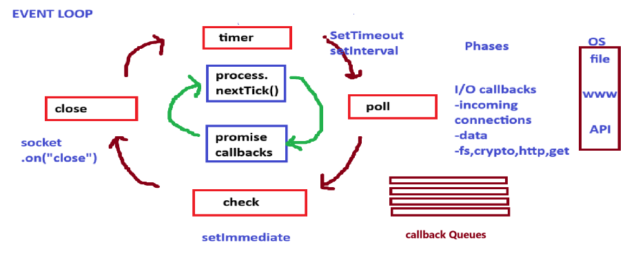

# Node.js Architecture & Event Loop

## 📌 Node.js Architecture

Node.js follows a single-threaded event-driven model powered by the V8 JavaScript engine and libuv. Instead of creating multiple threads for each request, Node.js manages concurrency using asynchronous callbacks and a non-blocking I/O mechanism.

### 🔹 Key Components

* **V8 Engine** — Executes JavaScript code
* **libuv** — Manages thread pool, event loop, I/O operations
* **Event Loop** — Handles async tasks and callbacks
* **C++ Bindings** — Bridge between JS and system-level APIs
* **Thread Pool** — Used for heavy tasks like file system and crypto

### 🖼 Node.js Architecture Diagram

---

## ⚙️ Node.js Event Loop

The event loop is the core of Node.js asynchronous behaviour. Even though JS is single-threaded, the event loop enables it to handle thousands of concurrent operations without blocking.

### 🔥 Event Loop Phases

1. **Timers Phase** — Executes `setTimeout` & `setInterval`
2. **Pending Callbacks** — Executes I/O callbacks waiting to run
3. **Idle/Prepare** — Internal use only
4. **Poll Phase** — Retrieves new I/O events, runs callbacks
5. **Check Phase** — Executes `setImmediate`
6. **Close Callbacks** — Executes close handlers like `socket.close`

### 🖼 Event Loop Flow

---

## 📄 Summary

* Node.js is built using V8 + libuv on top of a single thread.
* It scales efficiently through the event loop and async callbacks.
* Ideal for I/O-intensive applications like APIs & real-time systems.

---

🚀 **Ready to learn more?** Ask me for deep explanations or real-world examples!
